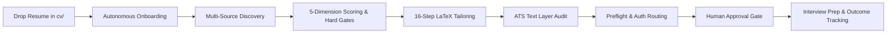

# 🚀 Antigravity Job Search Tool

*An autonomous, production-grade career automation engine and application orchestrator designed for **Google Antigravity** and **Claude Code**.*

[](https://www.python.org/)
[](https://bun.sh/)
[](https://www.latex-project.org/)
[](README.md)
[](https://github.com/akash-yadav12/antigravity-job-search-tool)
[](SECURITY.md)

---

## 🌟 Overview

The **Antigravity Job Search Tool** is an autonomous agentic framework that transforms your job hunt from a manual, exhausting chore into an automated, high-precision engineering pipeline.

Instead of writing one-off cover letters or manually tweaking resumes for dozens of job boards, you can simply **clone this repository, drop your existing resume into the `cv/` folder**, and let the agent take complete hold of your career data.

The framework autonomously:
1. **Parses & extracts** your professional record into a structured, unified profile.
2. **Discovers opportunities** across LinkedIn, Freehire, and direct enterprise career platforms (Workday, Greenhouse, Lever, SmartRecruiters, Ashby).
3. **Evaluates & scores** fit using a calibrated 5-dimension rubric, compensation benchmarks, and hard qualification gates.
4. **Drafts, audits, and compiles** tailored 1-page LaTeX CVs (LuaLaTeX) and cover letters (XeLaTeX).
5. **Verifies ATS parseability** using deep text-layer extraction tools.
6. **Routes submission workflows** via browser automation with strict human-in-the-loop approval.
7. **Prepares interview packs** and tracks every application in a central tracker.

---

## 🪟 Cross-Platform Compatibility (Windows, macOS & Linux)

The framework is **100% cross-platform** and built from the ground up to support **Windows 10/11**, **macOS**, and **Linux** without requiring WSL or virtualization:

| Feature / Tool | Windows (PowerShell / CMD) | macOS (zsh / bash) | Linux (bash) |
| :--- | :--- | :--- | :--- |
| **Python** | `python` or `py` (`sys.executable` auto-detected) | `python3` | `python3` |
| **Bun CLI** | `bun.exe` (`irm bun.sh/install.ps1 \| iex` or `winget`) | `bun` (`brew` or `curl`) | `bun` (`curl -fsSL https://bun.sh/install`) |
| **LaTeX Engine** | [MiKTeX](https://miktex.org/download) (`winget install MiKTeX.MiKTeX`) | [MacTeX](https://tug.org/mactex/) (`brew install --cask mactex-no-gui`) | TeX Live (`apt install texlive-luatex texlive-xetex`) |
| **Credentials** | Windows DPAPI / Windows Credential Store | macOS Keychain (`/usr/bin/security`) | `secret-tool` / Python `keyring` |
| **ATS Extractor** | Pure Python `pypdf` (zero binaries) or `choco install poppler` | `pypdf` or `brew install poppler` | `pypdf` or `apt install poppler-utils` |
| **Path Handling** | Native `Path` / `os.path` (handles `\` & `/` seamlessly) | POSIX paths | POSIX paths |

---

## ⚡ Key Capabilities



### 1. Drop-In CV Ingestion & Bootstrapping
- **Zero-Friction Onboarding**: Drop any resume (`.pdf`, `.tex`, `.txt`) into `cv/` or `documents/cv/`.
- **Automated Text Extraction**: Built-in `tools/import_cv.py` uses pure Python `pypdf` (and fallback `pdftotext`) to extract contact information, work history, achievements, and technical skills.
- **Configures Workspace Automatically**: Populates `data/candidate_profile.json`, `CLAUDE.md`, structured skill files (`01-candidate-profile.md`, `02-behavioral-profile.md`, `04-job-evaluation.md`, `05-cv-templates.md`, `07-interview-prep.md`), and compiles your master LuaLaTeX resume baseline (`cv/main_example.tex`).

### 2. Multi-Source Job Discovery Engine
- **Cross-Platform Ingestion**: Aggregates job listings using Bun-based CLIs for LinkedIn and Freehire, European/Danish portals, and direct ATS platform scrapers (Workday, Greenhouse, Lever, SmartRecruiters, Ashby).
- **Automated Ingestion**: Ingests postings directly into `job_scraper/seen_jobs.json` with provenance tracking.
- **Run Standalone or via Agent**: Trigger with `/scrape` in Antigravity or execute directly:
  - macOS/Linux: `python3 tools/discovery_engine.py`
  - Windows: `python tools/discovery_engine.py`

### 3. Data Normalization & Freshness Engine
- **Canonical IDs**: Normalizes messy URLs, extracts requisition IDs, and generates deterministic UUIDs (`tools/normalization.py`) to prevent duplicate applications across aggregator boards.
- **Freshness Scoring**: Analyzes posting timestamps, recency decay, and active requisition status (`tools/freshness_engine.py`) to eliminate ghost jobs and expired listings.

### 4. Compensation Intelligence & Company Tier Modeling
- **Benchmark Database**: Compares opportunities against market compensation data (`data/compensation_benchmarks.json`).
- **Tier Classification**: Categorizes companies into Tier A (Big Tech / Unicorns), Tier B (Established Enterprise), and Tier C (`tools/company_tier_model.py`, `data/company_watchlist.json`).
- **Dynamic Candidate Targets**: Evaluates minimum acceptable base pay, target total compensation, and currency thresholds configured in `data/candidate_profile.json` (`tools/compensation_engine.py`).

### 5. Calibrated 5-Dimension Hard Gate & Fit Scoring
- **Rubric Scoring**:
  - **Technical Fit (30%)**: Tech stack alignment, architecture, and language matching.
  - **Experience Match (25%)**: Years of experience, role family, and scope of responsibilities.
  - **Culture & Behavioral Fit (15%)**: Alignment with work style and team values.
  - **Career Alignment (20%)**: Trajectory toward stated career goals.
  - **Location Fit (10%)**: Commute boundaries, hybrid requirements, and remote feasibility.
- **Automated Hard Gates**:
  - *Language Gate*: Rejects jobs requiring undeclared languages.
  - *Seniority Floor*: Filters out extreme mismatch requirements.
  - *Domain Mismatch*: Flags niche hardware, low-level firmware, or unrelated domains.
  - *Current Employer Exclusion*: Dynamically prevents applications to your current employer.
- **Actionable Tiers**: Categorizes jobs into **P0** (Immediate Apply), **P1**, **P2**, **P3**, or **Hard-Rejected**.

### 6. Production 16-Step Application Generation Lifecycle (`/apply`)
For any target job posting (URL or pasted text), the agent runs the strict 16-step lifecycle:
1. **Fetches live job posting** and verifies active status.
2. **Selects narrative**: Focuses resume bullets on the most relevant angle (`Backend / Distributed Systems`, `AI / Developer Productivity`, `Full Stack / Platform`).
3. **Drafts 1-page moderncv LuaLaTeX CV** (`cv.tex` $\rightarrow$ `cv.pdf`).
4. **Drafts 1-page XeLaTeX cover letter** (`cover_letter.tex` $\rightarrow$ `cover_letter.pdf`).
5. **Zero Hallucination Grounding Audit**: Validates every bullet point, date, title, and metric against your canonical profile.
6. **ATS Audit**: Runs `tools/verify_pdf.py` to extract the embedded text layer, verifying keyword coverage, contact visibility, and strict 1-page constraints.
7. **Organizes Output**: Stores the complete package in `documents/applications/<Company>/<Role>/`.
8. **Updates Tracker**: Records entry in `job_search_tracker.csv` as `drafted`.
9. **Human Approval Gate**: Stops and waits for your explicit review.

### 7. Automated Submission & Auth Routing (`/submit`)
- **Preflight Asset Verification**: Checks that required CV and cover letter PDFs are rendered and valid (`tools/submit_preflight.py`).
- **Authentication Routing**:
  - **No-Auth Portals** (Lever, SmartRecruiters, Ashby): Automates form filling using browser automation (`browser_subagent`), uploading PDFs and auto-answering standard questions.
  - **Auth-Required Portals** (Workday, LinkedIn Easy Apply): Routes directly to your manual queue with pre-filled details.
  - **Unknown Portals**: Halts and prompts the user for instructions.
- **Grounded Answers Provider**: Resolves screening questions (contact info, notice period, graduation dates) strictly from profile facts (`tools/submit_adapters/answers_provider.py`). Sensitive questions (salary, visa, clearances) always halt with `STOP_AND_ASK`.
- **Fail-Closed Review Gate**: The browser stops at the review page and **never clicks Submit without your explicit confirmation ("Submit it")**.

### 8. Interview Preparation & Outcome Analytics
- **Company Research Cache**: Automatically researches company tech stack, recent news, and leadership, caching results in `company_research/`.
- **STAR Prep Packs**: Generates stage-specific interview packs (`/interview <Company>`) pairing job requirements with your real STAR stories.
- **Outcome Tracking**: `/outcome <Company>` tracks interview stages, rejections, offers, and retrospective learnings in `job_search_tracker.csv`.
- **Visual Reporting**: `/html-report` compiles your active pipeline into a responsive HTML dashboard.

---

## 🚦 How Any User Can Use This Tool

### Step 1: Clone the Repository
```bash
git clone https://github.com/akash-yadav12/antigravity-job-search-tool.git ai-job-search
cd ai-job-search
```

### Step 2: Drop Your Resume in `cv/`
Copy your current resume into the `cv/` folder:

- **macOS / Linux**:
  ```bash
  cp /path/to/your_resume.pdf cv/resume.pdf
  ```
- **Windows (PowerShell)**:
  ```powershell
  Copy-Item $HOME\Downloads\your_resume.pdf cv\resume.pdf
  ```

*(Optional: place supporting documents like reference letters or a LinkedIn PDF export in `documents/references/` or `documents/linkedin/`)*.

### Step 3: Run Onboarding
You have two easy ways to onboard:

**Option A: Through Google Antigravity or Claude Code (Recommended)**
Simply message the agent:
> *"I have added my resume in `cv/`. Please set up my profile."*

The agent reads `cv/resume.pdf`, extracts your professional history, populates `data/candidate_profile.json`, `CLAUDE.md`, and skills, and compiles your master LuaLaTeX CV.

**Option B: Via CLI**
- **macOS / Linux**:
  ```bash
  python3 tools/import_cv.py --auto
  ```
- **Windows (PowerShell / CMD)**:
  ```powershell
  python tools/import_cv.py --auto
  # or: py tools/import_cv.py --auto
  ```

### Step 4: Discover & Rank Jobs
Run the discovery pipeline to fetch new listings:
- **macOS / Linux**:
  ```bash
  python3 tools/run_pipeline.py
  ```
- **Windows**:
  ```powershell
  python tools/run_pipeline.py
  ```
Or use the native agent slash commands in Antigravity or Claude:
```
/scrape
/rank
```

### Step 5: Tailor & Generate Application Packages
Apply to a single posting:
```
/apply https://jobs.lever.co/example/12345
```
Or generate a tailored batch for your top opportunities:
- **macOS / Linux**:
  ```bash
  python3 tools/generate_batch.py --tier P0 --limit 5
  ```
- **Windows**:
  ```powershell
  python tools/generate_batch.py --tier P0 --limit 5
  ```
Each package is neatly arranged under `documents/applications/<Company>/<Role>/` with `cv.pdf`, `cover_letter.pdf`, `job_description.md`, and `tailoring_notes.md`.

### Step 6: Review & Submit
Inspect your compiled PDFs with Antigravity's `view_file` tool. When satisfied:
```
/submit <Company> <Role>
```
The agent navigates the application portal, populates form fields, uploads your tailored documents, and pauses at the final review page. Type `"Submit it"` to authorize submission.

### Step 7: Prepare for Interviews & Track Progress
```
/interview <Company>
/outcome <Company>
/html-report
```

---

## 📁 Repository Structure

```
.
├── .agents/skills/              # Antigravity native discoverable skills (apply, submit, setup, etc.)
│   ├── apply/SKILL.md           # 16-step production application generation lifecycle
│   ├── submit/SKILL.md          # Browser automation & auth routing submission workflow
│   ├── setup/SKILL.md           # Drop-in resume onboarding workflow
│   ├── rank/SKILL.md            # Fit scoring & priority triaging
│   ├── scrape/SKILL.md          # Job scraper orchestration
│   ├── interview/SKILL.md       # Interview prep & company research
│   └── outcome/SKILL.md         # Application outcome tracking
├── .claude/                     # Canonical domain methodology & commands
│   ├── commands/                # Step-by-step agent instructions (apply, setup, submit, etc.)
│   └── skills/                  # Candidate profiling, job evaluation, and writing guidelines
├── cv/                          # Resume master templates and user drop folder
│   ├── main_example.tex         # Master LuaLaTeX CV template (moderncv banking style)
│   └── resume.pdf               # (User drops their resume here)
├── cover_letters/               # Cover letter master templates
│   ├── cover.cls                # XeLaTeX cover letter class (Raleway + Lato typography)
│   ├── cover_example.tex        # Master cover letter template
│   └── OpenFonts/               # Bundled OpenType and TrueType fonts
├── data/                        # Structured configuration & market benchmarks
│   ├── candidate_profile.json   # Machine-readable candidate profile & targets
│   ├── company_watchlist.json   # Tiered target company list & career URLs
│   └── compensation_benchmarks.json # Salary benchmarks across levels and tiers
├── documents/                   # Drop folders for career assets & generated applications
│   ├── applications/            # Immutable company/role application folders
│   ├── cv/                      # Alternate drop folder for candidate CVs
│   ├── linkedin/                # LinkedIn PDF exports
│   └── references/              # Reference letters
├── job_scraper/                 # Discovery storage
│   └── seen_jobs.json           # Scraped, normalized, and ranked opportunities
├── tools/                       # Production Python & TypeScript tooling
│   ├── import_cv.py             # Automatic CV text extraction and onboarding utility
│   ├── generate_batch.py        # Priority-tier batch application generator
│   ├── run_pipeline.py          # End-to-end discovery, scoring, and gating pipeline
│   ├── discovery_engine.py      # Multi-source platform and ATS discovery
│   ├── evaluator.py             # Calibrated 5-dimension scoring & hard gates
│   ├── compensation_engine.py   # Salary benchmarking and qualification engine
│   ├── company_tier_model.py    # Company tier resolution
│   ├── ats_verifier.py          # ATS requisition and structure verification
│   ├── freshness_engine.py      # Posting recency and status verification
│   ├── normalization.py         # URL cleaning and canonical job ID generation
│   ├── verify_pdf.py            # Text-layer extraction & 1-page compliance checker
│   └── submit_adapters/         # Preflight validation & portal submission adapters
├── job_search_tracker.csv       # Application tracker (14 canonical columns)
├── GEMINI.md                    # Antigravity agent instructions & tool translation
├── CLAUDE.md                    # Canonical candidate profile & Claude Code guidelines
├── QUICKSTART.md                # 3-step quick onboarding guide
└── SETUP.md                     # Detailed environment prerequisites & dependencies
```

---

## 🔒 Security, Privacy & Invariants

- **100% Local & Private**: All profile data, resumes, applications, and logs remain on your local machine. `job_search_tracker.csv` is gitignored by default so you never accidentally publish your job applications to GitHub.
- **Zero Hallucination Invariant**: The agent is strictly grounded in `candidate_profile.json` and `01-candidate-profile.md`. It is architecturally prohibited from inventing metrics, falsifying dates, or inflating titles.
- **Fail-Closed Human Approval**: Applications and outbound actions require explicit confirmation. The agent stops at `DRAFTED → AWAITING APPROVAL` and will never submit an application without your explicit instruction.
- **Safe Authentication**: Automated submission routing operates only on unauthenticated portals (Lever, SmartRecruiters, Ashby). Passwords, OTPs, and session cookies are never stored in plain text or persisted to disk.

---

## 💻 Environment Setup Guide

### 1. Python (3.10+)
- **Windows**: Install Python from [python.org](https://www.python.org/downloads/) (check *"Add python.exe to PATH"* during install) or run:
  ```powershell
  winget install Python.Python.3.12
  ```
- **macOS**: `brew install python`
- **Linux**: `sudo apt install python3 python3-pip`

Install the lightweight text extraction dependency:
```bash
pip install pypdf
```

### 2. Bun (Job Search CLIs)
- **Windows (PowerShell)**:
  ```powershell
  powershell -c "irm bun.sh/install.ps1 | iex"
  # or using winget:
  winget install Oven-sh.Bun
  ```
- **macOS / Linux**:
  ```bash
  curl -fsSL https://bun.sh/install | bash
  ```

### 3. LaTeX (LuaLaTeX & XeLaTeX for CVs & Cover Letters)
The CV compiles with `lualatex` (moderncv) and the cover letter compiles with `xelatex` (custom fontspec typography).

- **Windows**: Install [Basic MiKTeX](https://miktex.org/download) or run:
  ```powershell
  winget install MiKTeX.MiKTeX
  ```
  *Tip for MiKTeX*: Turn on silent automatic package installation so LaTeX doesn't pause for prompts:
  ```powershell
  initexmf --set-config-value=[MPM]AutoInstall=1
  ```
- **macOS**: Install MacTeX via Homebrew:
  ```bash
  brew install --cask mactex-no-gui
  ```
- **Linux (Ubuntu / Debian)**:
  ```bash
  sudo apt install texlive-luatex texlive-xetex texlive-latex-extra texlive-fonts-extra poppler-utils
  ```

---

## 🤝 Contributing & License

Contributions are welcome! Please feel free to submit a pull request or open an issue for new portal adapters, ATS scrapers, or scoring heuristics.

Distributed under the [MIT License](LICENSE).
